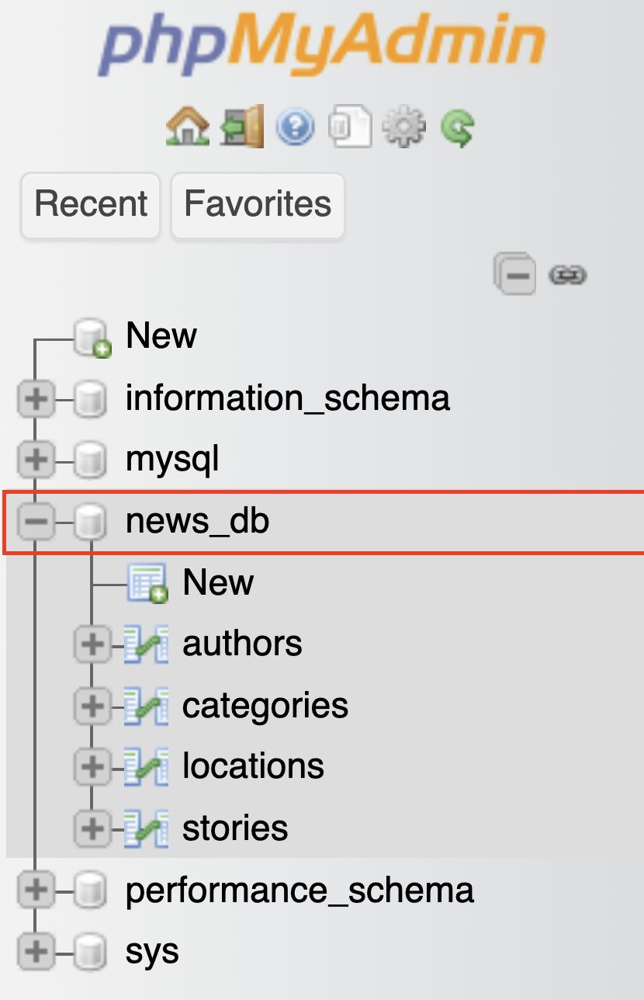
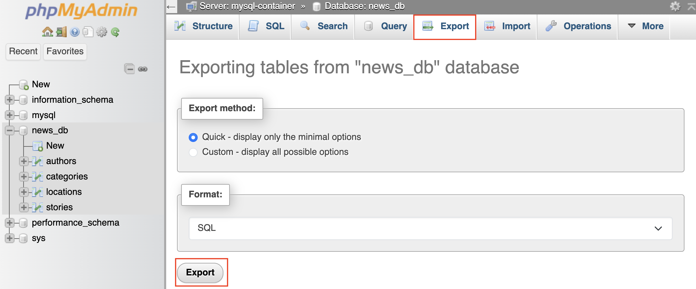

# Syncing Your Database Between Computers

When you make changes to your database (add data, columns, tables, etc.), those changes only exist on the computer you're working on. To bring them to another computer, you need to:

1. **Export** the database to a file
2. **Push** it to GitHub
3. **Pull** it on the other computer and **reset** the database

## Exporting Your Database

After making changes in PHPMyAdmin, you need to save them to a file.

1. Open PHPMyAdmin at **http://localhost:8081**
2. Click on `news_db` in the sidebar



3. Click the **Export** tab at the top

4. Leave the settings as they are — **Quick** and **SQL** should already be selected



5. Click **Export**
6. A file will download (usually called `news_db.sql`). Move it into your project's `src/sql/` folder and rename it to `news.sql`, replacing the old file

Now commit and push:

```bash
git add src/sql/news.sql
git commit -m "Update database"
git push
```

## Resetting Your Database on Another Computer

On your other computer, pull the latest changes:

```bash
git pull
```

Then reset the database so it rebuilds from the updated file. Run this in your terminal:

```bash
docker compose down
```

Next, delete the `docker/mysql/data` folder. You can do this in VSCode or from the terminal:

```bash
rmdir /s /q docker\mysql\data
```

Then start everything back up:

```bash
docker compose up -d
```

When MySQL starts with no existing data, it automatically runs `src/sql/news.sql` to set up the database. Your changes from the other computer will now be there.

> The `docker/mysql/data` folder is **not** part of your Git repo, it only exists on your machine. Deleting it is safe and expected.

### Check that it worked

Open PHPMyAdmin at **http://localhost:8081**, click on `news_db`, and browse your tables to make sure the data looks right.

## Quick Reference

| I want to...                                          | What to do                                                                            |
| ----------------------------------------------------- | ------------------------------------------------------------------------------------- |
| Save my database changes to bring to another computer | **Export** from PHPMyAdmin, replace `src/sql/news.sql`, commit and push               |
| Load database changes on another computer             | Pull from GitHub, **delete** `docker/mysql/data`, restart with `docker compose up -d` |
| Fix a broken database                                 | **Delete** `docker/mysql/data` and restart — it rebuilds from `src/sql/news.sql`      |
