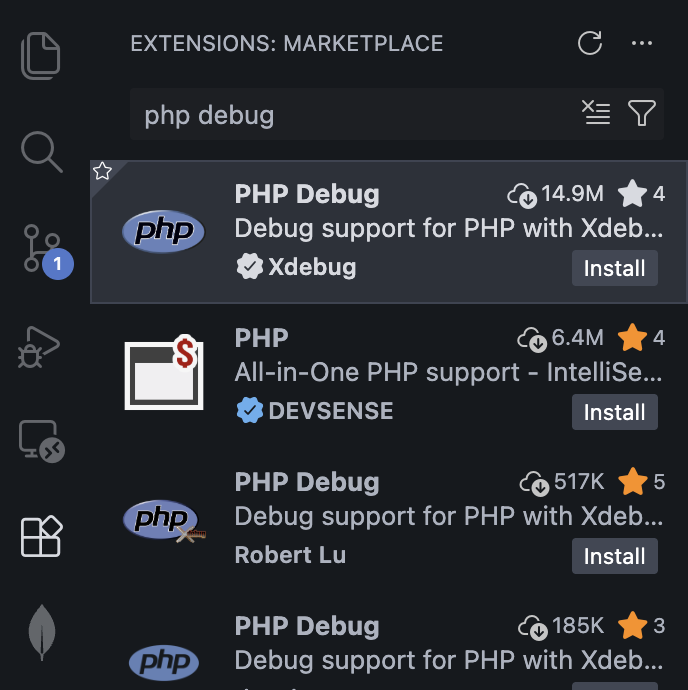
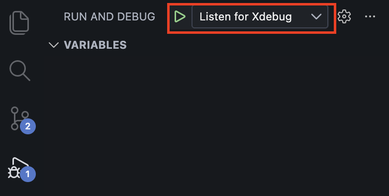
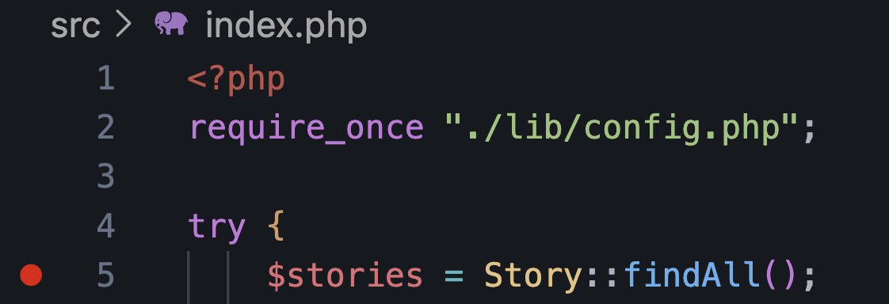
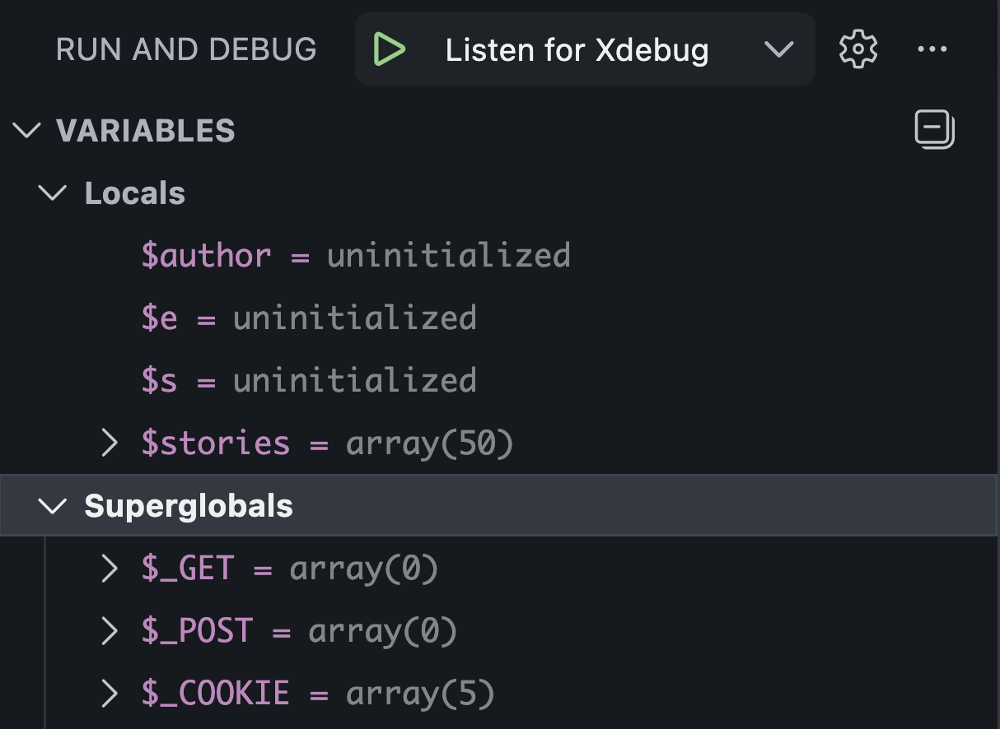

# PHP Debugging Guide

This guide covers two approaches to debugging PHP in this project:

1. Debugging with `print_r` and `var_dump` (no setup required)
2. **Interactive debugging** with XDebug + VSCode

## Debugging with print_r and var_dump

These built-in PHP functions let you inspect variables directly in the browser or terminal output.

### print_r

`print_r` outputs human-readable information about a variable. It's best for arrays and objects.

```php
// In src/index.php — inspect the $stories array after it's fetched
$stories = Story::findAll();
echo '<pre>';
print_r($stories);
echo '</pre>';
```

Example output:

```
Array
(
    [0] => Story Object
        (
            [id] => 1
            [headline] => Breaking News
            [subheadline] => Something happened
            [article] => Full article text...
            [author_id] => 7
            [category_id] => 4
            [location_id] => 8
        )
)
```

### var_dump

`var_dump` outputs detailed type and length information for each value. It's more verbose than `print_r` but useful when you need to know exact types.

```php
// In src/classes/Story.php — inspect what findById returns
$story = new Story($row);
echo '<pre>';
var_dump($story);
echo '</pre>';
```

Example output:

```
object(Story)#3 (10) {
  ["id"]=> string(1) "1"
  ["headline"]=> string(13) "Breaking News"
  ["author_id"]=> string(1) "7"
  ["category_id"]=> NULL
  ...
}
```

## Interactive Debugging with XDebug + VSCode

XDebug lets you set breakpoints, step through code line by line, and inspect variables in VSCode's debugger UI. This is significantly more powerful than print/dump debugging for complex issues.

### 1. Install the VSCode Extension

1. Open VSCode
2. Go to the Extensions view (`Cmd+Shift+X`)
3. Search for **"PHP Debug"** by **Xdebug**
4. Click **Install**



### 2. Start Debugging

1. In the **Run and Debug** panel, select **"Listen for XDebug"** from the dropdown
2. Click the green play button (or press `F5`)
3. The status bar at the bottom of VSCode will turn orange, indicating it's listening for XDebug connections

<!-- TODO: Add screenshot of VSCode with the orange debug status bar -->


4. Open your project in the browser (e.g., `http://localhost:8080/index.php`)
5. XDebug will connect to VSCode and pause at your first breakpoint

### 6. Using the Debugger

#### Setting Breakpoints

Click in the gutter (left of the line numbers) to set a breakpoint. A red dot will appear.

<!-- TODO: Add screenshot of a breakpoint set in index.php with the red dot visible -->


#### Debugger Controls

Once paused at a breakpoint, use the debug toolbar:

| Button    | Action                                        |
| --------- | --------------------------------------------- |
| Continue  | Run to the next breakpoint                    |
| Step Over | Execute the current line, move to the next    |
| Step Into | Jump into the function being called           |
| Step Out  | Finish the current function, return to caller |
| Restart   | Restart the debug session                     |
| Stop      | End the debug session                         |

#### Inspecting Variables

While paused at a breakpoint, you can inspect variables in several ways:

- **Variables panel** (left sidebar): Shows all local and global variables and their current values
- **Hover**: Hover over any variable in the editor to see its value
- **Watch**: Add expressions to the Watch panel to monitor specific values (e.g., `$s->author_id`, `count($stories)`)


